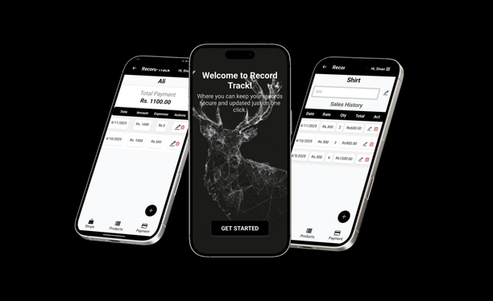

# 💼 Hassan Arslan's Personal Portfolio

Welcome to my personal portfolio website! This is a **responsive** and visually appealing web-based portfolio to showcase my work, skills, and contact information as a passionate **Software Developer**.

---

## 🚀 Live Preview

[](http://hassan-arslan.vercel.app)

---

## 📌 Features

- 🌐 **Fully responsive layout** (HTML, CSS, JavaScript)
- 🧑‍💻 **Sections:** About Me, Skills, Portfolio, and Contact
- 📲 **Integrated social media icons:** LinkedIn, GitHub, Instagram, Facebook
- 📩 **Contact form** connected to Google Sheets using Google Apps Script
- 📎 **Resume download option**
- 📽️ **Clean animated visuals** and project previews
- 📂 **Project-based portfolio section** with links to GitHub repositories

---

## 📸 Preview

<p align="center">
  
</p>
<!-- Replace with an updated screenshot if needed -->

---

## 🛠️ Tech Stack

- **HTML5**
- **CSS3** (Custom styling with responsive design)
- **JavaScript** (DOM manipulation and form handling)
- **Font Awesome** (icons)
- **Google Fonts** (Poppins)
- **Google Apps Script** (form submission to Google Sheets)

---

## 📁 Folder Structure

```
Portfolio/
├── assets/
│   ├── logo1-Photoroom.png
│   ├── RecordTrack.png
│   ├── HelpHive.png
│   └── deliveroo.jpg
├── index.html
├── style.css
└── Hassan Arslan Aamir.pdf
```

---

## 📝 How to Use

1. **Clone the repo:**
   ```sh
   git clone https://github.com/Hassan89221/portfolio.git
   ```
2. **Open** `index.html` in your browser or deploy it using GitHub Pages or Netlify.

_Add your own assets, images, or replace text as needed to customize._

---

## 📬 Contact

- **Email:** hassanarslanamir@gmail.com
- **LinkedIn:** [linkedin.com/in/hassan-arslan-590090253](https://linkedin.com/in/hassan-arslan-590090253)
- **GitHub:** [github.com/Hassan89221](https://github.com/Hassan89221)

---

## 📜 License

This project is open-source and available under the **MIT License**.

---

## 🙌 Thank you for visiting!

If you like it, feel free to give it a ⭐

_Let me know if you want this tailored more toward recruiters or you’d like to add deployment instructions._
